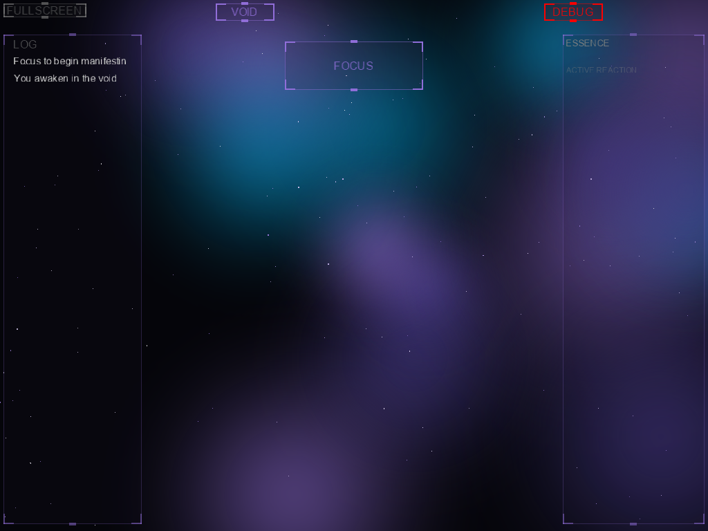

# IncriElemental - An Unfolding Incremental Game

**IncriElemental** is an atmospheric, unfolding incremental game built with **MonoGame** and **.NET 10.0**. You play as a consciousness awakening in a void, manifesting physical reality through elemental magic.

## 🌌 Visuals
The game features a high-fidelity **Aetherial Glow** aesthetic, powered by dynamic HLSL bloom, multi-layered parallax backgrounds, reactive volumetric aether clouds, and alchemical liquid simulations.

*See the full [Visual Gallery](review/gallery.md) for examples of the Spire, World Map, Alchemical Mixing, and Holographic HUD.*

## 🌌 The Experience
- **Unfolding Gameplay:** Start with a single "Focus" action and manifest a complex elemental engine.
- **Adaptive Runic HUD:** Modern, semi-transparent panels with kinetic runic borders that pulse and accelerate based on game activity.
- **Volumetric Aether:** Procedural, reactive cloud background with wave-equation simulations for ripples and alchemical tinctures.
- **Holographic Popups:** Numeric feedback distorted by runic jitter and scanline shaders for an "awakening" alchemical feel.
- **Dynamic Atmosphere:** Multi-layered Nebula backgrounds with independent parallax and pulsing stars synced to the void hum.
- **Interactive Feedback:** Impact screen-shake, holographic interaction ripples, and cinematic camera swells for major milestones.
- **Spatial Synergies:** The World Map features animated biome-specific shaders (Ocean ripples, Mountain heat-haze) and pulsing Auras.
- **New Game+:** Reach Ascension to earn "Cosmic Insight," celebrated by an intense cinematic zoom and white-out transition.

## 🛠️ Technical Highlights
- **Advanced Agentic DevOps:** 
    - **Visual Perception:** AI utilizes screenshots and **UI Metadata (JSON)** to verify game state autonomously.
    - **Semantic Intent:** UI elements tagging with alchemical purpose (e.g., "PrimaryAction," "TabNavigation") for intelligent agentic guidance.
    - **Visual Regression:** Automated "Golden Reference" testing to detect layout shifts, illegal overlaps, and intent mismatches.
    - **Heuristic Audits:** Automated scripts for **Palette Compliance**, **WCAG Contrast**, and **Parallax Depth**.
    - **Aesthetic Verification:** "Glow Scoring" ensures atmospheric fidelity remains consistent across all loops.
- **Graphics Pipeline:** Custom HLSL shaders for bloom and dynamic color grading based on dominant elements.
- **Component Architecture:** ECS-lite manifestation system defined in JSON for rapid mechanical expansion.

## 🚀 Quick Start
1.  **Build & Run:** `dotnet run --project src/IncriElemental.Desktop/IncriElemental.Desktop.csproj`
2.  **Test:** `dotnet test`
3.  **Health Check:** `python scripts/check_health.py`
4.  **Generate Gallery:** `python scripts/generate_gallery.py`
5.  **Visual Sanity:** `python scripts/visual_sanity_check.py`

## 📜 License
This project is licensed under the **MIT License**.

---
*Last Updated: Tuesday, March 17, 2026 (Updated by Agent Gemini)*
